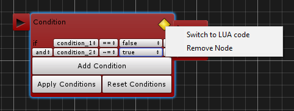
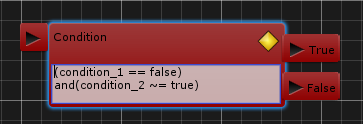
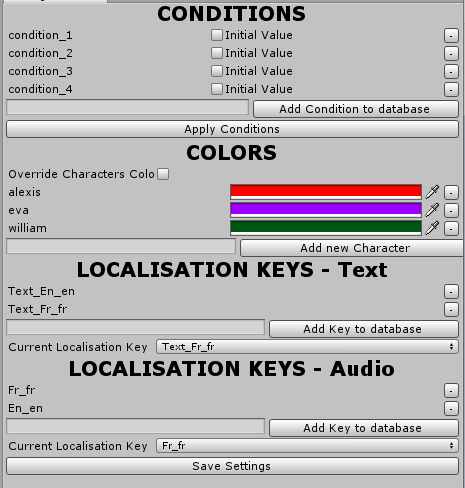
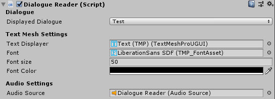
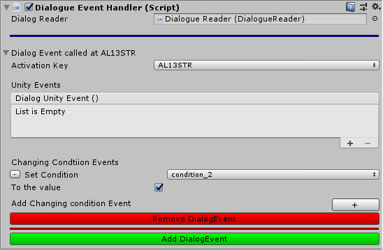

# A Nodal Dialogues Editor For Unity Engine!

[Version Française](https://github.com/ThiebautAlexis/DialogEditor#[FR])
[English Version](https://github.com/ThiebautAlexis/DialogEditor#[EN])

### [FR] 

Bonjour à tous! 
J'ai créé un outil  d'édition de dialogues inspiré de cette conférence animée par Anna Kipnis de Double Fine Productions à la GDC 2015. Il est fortement recommandé de la regarder puisque j'utilise beaucoup de mécanismes présentés dans cette conférence (et en plus, elle est très intéressante!).

[](https://www.youtube.com/watch?v=0hMiPBe_VRc "Dialogue Systems in Double Fine Games")

Passons maintenant aux choses sérieuses! 

Avant tout pour commencer, comment ouvrir la fenêtre d'édition des dialogues ? Simplement, vous pouvez trouver dans le menu déroulant sous Window une section "Dialogue Editor" et en cliquant sur Open Editor vous ouvrirez donc la fenêtre d'édition de dialogues.


## I. Créer un Dialogue Asset

Une fois sur la fenêtre d'édition de dialogues, vous pouvez faire un clic droit pour ouvrir un menu qui vous proposera deux options: créer ou ouvrir un dialogue. Nous allons donc en créer un.


Ici, vous avez donc deux champs à remplir:

**<u>Dialogue Name</u>** : Ceci sera le nom de votre dialogue, vous pourrez le retrouver dans le dossier Assets/DialoguesDatas/Dialogues.

**<u>Spreadsheet ID</u>**: Ici vous devrez renseigner l'ID de partage de votre Google Sheets. Vous pouvez le trouver en cliquant sur le bouton "Partager" en haut à droite de votre feuille de dialogues. Vous copierez donc un lien de cette forme https:/docs.google.com/spreadsheets/d/[spreadsheet_ID]/edit?usp=sharing et c'est cet ID qu'il faudra coller dans le champ Spreadsheet ID.

Puis en cliquant sur le bouton "Create Dialogue And Load Spreadsheet" vous allez donc créer un Dialogue Asset et télécharger le fichier TSV de votre spreadsheet sur votre ordinateur. Si vous avez apporté des modifications à votre spreadsheet, vous pouvez la mettre à jour en faisant un clic droit et en cliquant sur "Update Spreadsheet".

<b>[Concernant la Spreadsheet]</b>: La spreadsheet doit être sous cette forme afin de fonctionner avec cet outil.


Vous pouvez ensuite ajouter autant de langues que vous le souhaitez, mais il faut que cela reste sous cette forme avec les IDs, suivi des lignes de dialogues rangées en fonctions de chaque clé de localisation.

## II. Ajouter des nœuds à votre dialogue.

Maintenant que votre dialogue est créé, vous pouvez désormais commencer à l'éditer. Pour cela vous pouvez créer des nœuds en faisant un clic droit, il en existe 4 sortes:


1. ### <u>**Starting Node**</u>:


Le Start Node est utilisé pour savoir où le dialogue va commencer, il est présent par défaut et ne peut pas être supprimé. Vous pouvez ajouter des sorties à ce nœud en ajoutant des entrées à l'enum DialogStarterEnum dans le script EnumHolder.cs. 


Vous pourrez ensuite préciser vers quels nœuds poursuivre en fonction de l'enum choisi au moment de la lecture du dialogue (Cette partie sera expliquée plus en détail plus tard)


2. ### <u>**Basic Node**</u>:

 

Le Basic Node est le nœud de base des dialogues, il peut prendre une ou plusieurs lignes de dialogues.
Chaque ligne de dialogue possède plusieurs paramètres:

- <u>Line ID</u>: La clé d'identification de la ligne dans la spreadsheet du dialogue. Elle sera utilisée pour retrouver le contenu de la ligne de dialogue, et ce en fonction du langage sélectionné dans les options.
- <u>Inital Waiting Time</u>: Le temps d'affichage de la ligne de dialogue à l'écran. Si il y a un AudioClip lié à cette ligne de dialogue, ce temps d'affichage sera égal à la durée de l'audio clip, sinon il sera égal à la durée précisée dans ce champ.
- <u>Extra Waiting Type</u>: Il s'agit de type d'attente qui sera exécuté après le temps d'affichage de la ligne. Il peut s'agir d'un temps d'attente, l'attente d'un input par le joueur ou alors ne rien attendre. 

En plus de cela, le Basic Node a lui aussi des paramètres:

- Un premier pour choisir s'il doit jouer tout le set de lignes de dialogues ou seulement une seule.
- Un second pour choisir s'il doit jouer son set de lignes de dialogues aléatoirement ou séquentiellement.


3. ### <u>**Answer Node**</u>:

L'Answer Node est une variante du Basic Node, on peut l'ajouter en faisant un clic droit sur un Basic Node ou en cliquant sur l'icône en haut à droite du nœud. Ensuite on a ce menu qui nous permet d'effectuer la conversion.


Une fois converti, on obtient un nœud qui prend cette forme:

  

On a donc un nœud qui a plusieurs sorties qui peuvent nous diriger vers d'autres nœuds dans ce dialogue. De la même manière que le Basic Node, on peut choisir quelles seront les lignes de dialogues affichées en sélectionnant les IDs des lignes de dialogues correspondantes. Le joueur aura donc le choix de cliquer sur l'une des lignes de dialogues proposées, nous verrons son fonctionnement dans une partie ultérieure.   


4. ### <u>**Condition Node**</u> 


Le dernier type de nœud est un Condition Node, il permet de vérifier une condition et de continuer la lecture d'un dialogue vers un certain nœud si la condition est vérifiée et vers un autre si elle ne l'est pas.  Ces conditions sont écrites en LUA et sont définies dans les Settings du Dialogue Editor, nous y reviendront juste après.
L'écriture de conditions en LUA est différente de l'écriture en C#:

- "==" signifie l'égalité (comme en C#).
- "~=" signifie la différence (!= en C#).
- "and" est l'opérateur logique && en C#.
- "or" est l'opérateur logique || en C#.

L'utilisateur a la possibilité d'écrire lui même ses conditions en LUA en effectuant un clic droit sur le nœud ou en appuyant sur l'icône en haut à droite pour ouvrir un menu contextuel. 

Il pourra donc ensuite éditer ses conditions directement en LUA (<b>ATTENTION</b>: la déclaration du est faite <b>automatiquement</b>, il n'est pas nécessaire de la faire lors de l'édition du code en LUA).




## III. Régler les settings de l'éditeur de dialogues.

Pour ouvrir la fenêtre d'édition des settings, il suffit d'aller de nouveau dans le menu déroulant sous Window, puis dans la section Dialogue Editor puis dans Edit Settings.


Cela ouvrira une fenêtre comme celle-ci:



1. ### <u>**Conditions**</u>
   
   Dans cette première partie, vous pouvez entrer toutes les conditions utilisées par votre Dialogue Editor. Il suffit d'entrer le nom de votre condition dans le champ correspondant, d'appuyer sur le bouton Apply Conditions et de sauvegarder les settings.
   De plus, pour chaque condition, vous pouvez choisir sa valeur par défaut grâce au Toggle qui la suit.
   
2. ### <u>**Colors**</u>
   
   Vous pouvez aussi choisir d'appliquer des presets de couleurs pour certains personnages. Puisque l'identifiant de la ligne de dialogue contient les premières lettres du nom du personnage, nous pouvons les utiliser pour appliquer une couleur sur le TextMesh qui affichera la ligne de dialogue à l'écran.
   
3. ### <u>**Localisations Keys**</u>
   
   Les clés de localisations correspondent aux identifiants utilisés pour afficher le texte ou jouer les Audioclips avec la bonne langue. Les clés de localisations du texte correspondent aux identifiants que vous avez choisi de mettre dans votre spreadsheet. 
   De même pour les AudioClips, la clé de localisation correspondra au suffixe que vous appliquerez à votre asset en fonction de la langue dans laquelle il se trouve.

## IV. Le Runtime

1. ### Dialogue Reader



Le script DialogueReader permet de lire un dialogue grâce à la méthode 

```c#
StartDisplayingDialogue();
```

qui permet de lire tous les nœuds de dialogue partants de la sortie Default du Start Node. Cette méthode possède une surcharge qui permet de préciser avec quel enum il faut commencer à lire le dialogue.

```c#
StartDisplayingDialogue(DialogStarterEnum _starter);
```

Pour lire un dialogue en particulier, il suffit de sélectionner le dialogue correspondant dans le champ "Displayed Dialogue".

Dans les champs suivants on peut régler des paramètres concernant l'affichage du texte:

- On peut ainsi choisir quel TextMesh va afficher nos lignes de dialogue.
- On peut ensuite choisir quel police sera utilisée, mais aussi sa taille et sa couleur.

Et pour finir on peut choisir quel sera l'audio source qui émettra les sons relatifs aux lignes de dialogue.


2. ### Dialogue Event Handler 



Le Dialogue Event Handler, lorsqu'il est relié à un Dialogue Reader, permet d'appeler des Unity Events et de changer la valeur des conditions lorsqu'une ligne de dialogue est lue.
En sélectionnant la clé d'activation, qui correspond à l'ID de la ligne de dialogue jouée, on peut donc appeler les Unity Events reliés à celle-ci. Un Dialogue Event Handler peut stocker plusieurs Events à appeler en fonction de différentes clés. 


### [EN]

Hello everyone! 
I made a dialogues editing tool inspired by this lecture presented by Anna Kipnis from Double Fine Production at GDC 2015. I highly recommend to watch it because I use many features from this lecture (And it's really cool and interesting!) 

[](https://www.youtube.com/watch?v=0hMiPBe_VRc "Dialogue Systems in Double Fine Games")

Let's begin! 

First of all, How to open the editing dialogues window? It's preatty easy actually, you can find a "Dialogue Editor" section below the Window drop down menu. If you click on "Open Editor" it will open the Window to create and edit your dialogues.


## I.Create a Dialogue Asset

Once the Editing Window opened, you can right click to open a new menu that will show you two options: Open or create a new dialogue. Let's create a new one! 


Here, you have two fields to fill.

**<u>Dialogue Name</u>** : This will be the name of your dialogue. It will be saved in the folder Assets/DialoguesDatas/Dialogues.

**<u>Spreadsheet ID</u>**: Here you have to write the sharing ID of your Google Sheets. You can find it by clicking on the "Share" Button in the top left of your spreadsheet. You'll copy a link that looks like this one: https:/docs.google.com/spreadsheets/d/[spreadsheet_ID]/edit?usp=sharing and You'll have to paste this spreadsheet_ID in the Spreadsheet ID field.

Then, when you click on the "Create Dialogue and Load Spreadsheet", it will create a Dialogue Asset and download the TSV file from your spreadsheet on your computer. If you modified your spreadsheet, you can update it by right clicking and click on "Update Spreadsheet"

<b>[About the Spreadsheet]</b>: The spreadsheet has to be like this one below to works with the Editor


You can add as much languages as you want, but it has to follow this pattern: First the IDs of the dialogue lines, then the dialogue lines themselves according to the right localisation keys. 

## II. Add Nodes to the dialogue.

Since your dialogue is created, you can edit it now. When right clicking, you can add new Nodes to your dialogue.


1. ### <u>**Starting Node**</u>:


The Starting Node is used to know where does the dialogue will start. It is automatically created and can't be removed. You can add Output to this Node by adding entries in the DialogStarterEnum in the script EnumHolder.cs. 


You can choose which nodes to follow according to the selected enum when the dialog is read. (This part will be explained later).


2. ### <u>**Basic Node**</u>:

 

The Basic Node is the simplest dialogue node, it can contains several dialogue lines. Each dialogue line has parameters that can be edited. 

- <u>Line ID</u>: This is the identification key of the dialogue line in the spreadsheet of the dialog. It is used to find the right content according to the selected language in the options settings.
- <u>Inital Waiting Time</u>: This is the displaying time on screen for this dialogue line. If there is a Audioclip linked to this Dialogue, it will be displayed during the length of the AudioClip otherwise, it will be displayed during the Inital Waiting Time.
- <u>Extra Waiting Type</u>: This is the settings about the waiting time after the dialogue line has been displayed. It can be a delay, an input from the player or nothing.

Moreover, the Basic Node also has parameters 

- A first one to choose if it has to play all the set of dialogue lines or just one of them.
- A second one to choose if it has to play the dialog set randomly or sequentially.


3. ### <u>**Answer Node**</u>:

The Answer node is a variation of the Basic Node, we can convert it by right clicking on it or by clicking on the top right icon. Then we have this menu to convert it.


Once it had been converted, the node will look like this one below.

  

So we have a node with multiple outputs that can lead us to another nodes in this dialogue. Like the Basic Node, we can choose which dialogue lines will be displayed by selecting the linked IDs from the spreadsheet. The player will has the choice to click on each dialogue line to continue this dialogue. We'll see the inner working of this feature later.


4. ### <u>**Condition Node**</u> 


The last node type is the Condition Node, it checks a condition then an reroute the dialogue to a node when the condition is true and to another one when the condition is false. Those conditions are written in LUA and are defined in the Settings of the Dialogue Editor (We'll look at it just after this part). There is some particularities in the writing of LUA conditions:

- "==" means equality (like in C#).
- "~=" means  different (!= in C#).
- "and" is the && logic operator in C#.
- "or" is the || logic operator in C#.

The user has the possibility to write themself the LUA conditions by right clicking on the node or by clicking on the top left icon to open a context menu and switch to LUA code.

The user will be able to write the LUA conditions in a text area (**WARNING**: the if statement is made **automatically**, it is not necessary to write in the LUA code).


## III. Adjust settings of the Dialogue Editor.

To open the Dialogue Editor Settings Window, you just has to go back in the Window drop down menu, then int Dialogue Editor and click on the Edit Settings Menu.  


It will open a window like this one below:


1. ### <u>**Conditions**</u>

   In this first part, you can add the conditions used in your Dialogue Editor. You just have to fill the field with the name of your condition, then click on the Add Condition Button and Apply the Conditions. Don't forget to save the conditions to save them in Unity.
   For each condition, you can also set its default value in this window.

2. ### <u>**Colors**</u>

   You can also choose to apply color presets on some character's dialogue lines. Since the dialogue line ID contains the first letters of the character's name, we can use them to apply a color on the TextMesh that will display the dialog line of a specific character.

3. ### <u>**Localisation Keys**</u>

   Localisation Keys match with the identifiers used to display the dialog lines or playing Audio Clips according to the selected language. The text localisation keys match with the identifiers written in the spreadsheet of your dialogue. And the Audio Localisation Keys match with the postfixes applied to your audio asset according to the selected language.  

## IV. Le Runtime

1. ### Dialogue Reader


The Dialog Reader Script will allow the user to start reading the dialogue with the method:  

```c#
StartDisplayingDialogue();
```

This Methods read all dialogue nodes from the default output of the Starting node. This method is overloaded and takes a DialogStaterEnum as parameter to specify with which enum the dialogue starts.

```c#
StartDisplayingDialogue(DialogStarterEnum _starter);
```

To read a specific dialogue, you have to select this dialogue in the "Displayed Dialogue" field.

The next fields allow the user to adjust text displaying settings such as 

- Which Text Mesh will display the dialogue.
- The Font used by the Text mesh, its color and its size.

The last field match with the Audio Source that will play the Audio Clips of the dialogue lines.


2. ### Dialogue Event Handler 


The Dialogue Event Handler, when it is linked to a Dialogue Reader, allow the user to call Unity Events and to change the conditions values when a dialogue line is read by selecting the activation key matching with the Dialogue Line ID. A Dialogue Event Handler can hold multiple events called by multiple keys. 