# A Nodal Dialogues Editor For Unity Engine!

[FR]

Bonjour à tous! 
J'ai créé un outil  d'édition de dialogues inspiré de cette conférence animée par Anna Kipnis de Double Fine Productions à la GDC 2015. Il est fortement recommandé de la regarder puisque j'utilise beaucoup de mécanismes présentés dans cette conférence (et en plus, elle est très intéressante!).

Passons maintenant aux choses sérieuses! 

Avant tout pour commencer, comment ouvrir la fenêtre d'édition des dialogues ? Simplement, vous pouvez trouver dans le menu déroulant sous Window une section "Dialogue Editor" et en cliquant sur Open Editor vous ouvrirez donc la fenêtre d'édition de dialogues.

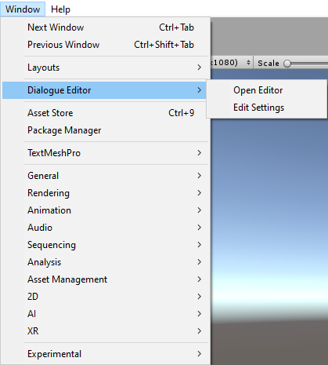

## I. Créer un Dialogue Asset

Une fois sur la fenêtre d'édition de dialogues, vous pouvez faire un clic droit pour ouvrir un menu qui vous proposera deux options: créer ou ouvrir un dialogue. Nous allons donc en créer un.

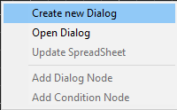

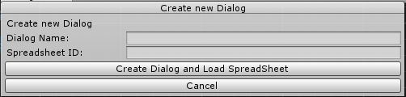

Ici, vous avez donc deux champs à remplir:

**<u>Dialogue Name</u>** : Ceci sera le nom de votre dialogue, vous pourrez le retrouver dans le dossier Assets/DialoguesDatas/Dialogues.

**<u>Spreadsheet ID</u>**: Ici vous devrez renseigner l'ID de partage de votre Google Sheets. Vous pouvez le trouver en cliquant sur le bouton "Partager" en haut à droite de votre feuille de dialogues. Vous copierez donc un lien de cette forme https:/docs.google.com/spreadsheets/d/[spreadsheet_ID]/edit?usp=sharing et c'est cet ID qu'il faudra coller dans le champ Spreadsheet ID.

Puis en cliquant sur le bouton "Create Dialogue And Load Spreadsheet" vous allez donc créer un Dialogue Asset et télécharger le fichier TSV de votre spreadsheet sur votre ordinateur. Si vous avez apporté des modifications à votre spreadsheet, vous pouvez la mettre à jour en faisant un clic droit et en cliquant sur "Update Spreadsheet".

<b>[Concernant la Spreadsheet]</b>: La spreadsheet doit être sous cette forme afin de fonctionner avec cet outil.

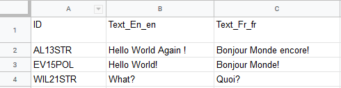

Vous pouvez ensuite ajouter autant de langues que vous le souhaitez, mais il faut que cela reste sous cette forme avec les IDs, suivi des lignes de dialogues rangées en fonctions de chaque clé de localisation.

## II. Ajouter des nœuds à votre dialogue.

Maintenant que votre dialogue est créé, vous pouvez désormais commencer à l'éditer. Pour cela vous pouvez créer des nœuds en faisant un clic droit, il en existe 4 sortes:

1. <u>**Starting Node**</u>:
   
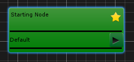

Le Start Node est utilisé pour savoir où le dialogue va commencer, il est présent par défaut et ne peut pas être supprimé. Vous pouvez ajouter des sorties à ce nœud en ajoutant des entrées à l'enum DialogStarterEnum dans le script EnumHolder.cs. 

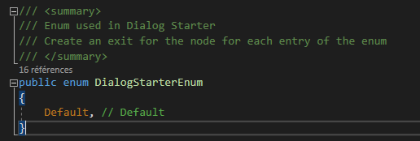

Vous pourrez ensuite préciser vers quels nœuds poursuivre en fonction de l'enum choisi au moment de la lecture du dialogue (Cette partie sera expliquée plus en détail plus tard)

2. <u>**Basic Node**</u>:

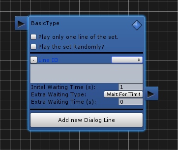 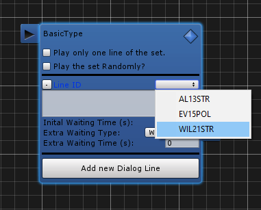

Le Basic Node est le nœud de base des dialogues, il peut prendre une ou plusieurs lignes de dialogues.
Chaque ligne de dialogue possède plusieurs paramètres:

- <u>Line ID</u>: La clé d'identification de la ligne dans la spreadsheet du dialogue. Elle sera utilisée pour retrouver le contenu de la ligne de dialogue, et ce en fonction du langage sélectionné dans les options.
- <u>Inital Waiting Time</u>: Le temps d'affichage de la ligne de dialogue à l'écran. Si il y a un AudioClip lié à cette ligne de dialogue, ce temps d'affichage sera égal à la durée de l'audio clip, sinon il sera égal à la durée précisée dans ce champ.
- <u>Extra Waiting Type</u>: Il s'agit de type d'attente qui sera exécuté après le temps d'affichage de la ligne. Il peut s'agir d'un temps d'attente, l'attente d'un input par le joueur ou alors ne rien attendre. 

En plus de cela, le Basic Node a lui aussi des paramètres:

- Un premier pour choisir s'il doit jouer tout le set de lignes de dialogues ou seulement une seule.
- Un second pour choisir s'il doit jouer son set de lignes de dialogues aléatoirement ou séquentiellement.

3. <u>**Answer Node**</u>:

L'Answer Node est une variante du Basic Node, on peut l'ajouter en faisant un clic droit sur un Basic Node ou en cliquant sur l'icône en haut à droite du nœud.
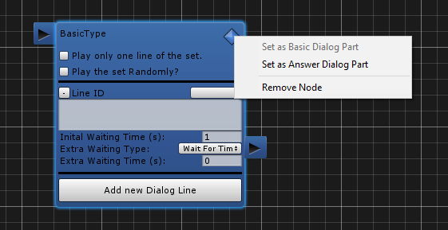

Une fois converti, on obtient un nœud qui prend cette forme:

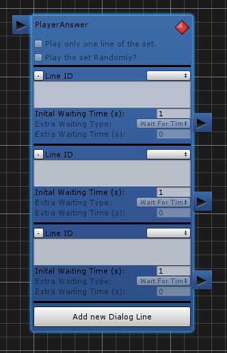  

On a donc un nœud qui a plusieurs sorties qui peuvent nous diriger vers d'autres nœuds dans ce dialogue. De la même manière que le Basic Node, on peut choisir quelles seront les lignes de dialogues affichées en sélectionnant les IDs des lignes de dialogues correspondantes. Le joueur aura donc le choix de cliquer sur l'une des lignes de dialogues proposées, nous verrons son fonctionnement dans une partie ultérieure.   

4. <u>Condition Node</u> 

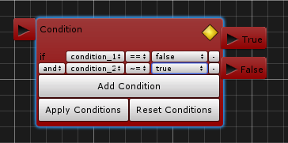

Le dernier type de nœud est un Condition Node, il permet de vérifier une condition et de continuer la lecture d'un dialogue vers un certain nœud si la condition est vérifiée et vers un autre si elle ne l'est pas.  Ces conditions sont écrites en LUA et sont définies dans les Settings du Dialogue Editor, nous y reviendront juste après.
L'écriture de conditions en LUA est différente de l'écriture en C#:

- "==" signifie l'égalité (comme en C#).
- "~=" signifie la différence (!= en C#).
- "and" est l'opérateur logique && en C#.
- "or" est l'opérateur logique || en C#.

L'utilisateur a la possibilité d'écrire lui même ses conditions en LUA en effectuant un clic droit sur le nœud ou en appuyant sur l'icône en haut à droite pour ouvrir un menu contextuel. 

Il pourra donc ensuite éditer ses conditions directement en LUA (<b>ATTENTION</b>: la déclaration du est faite <b>automatiquement</b>, il n'est pas nécessaire de la faire lors de l'édition du code en LUA).

## III. Régler les settings de l'éditeur de dialogues.

Pour ouvrir la fenêtre d'édition des settings, il suffit d'aller de nouveau dans le menu déroulant sous Window, puis dans la section Dialogue Editor puis dans Edit Settings.

Cela ouvrira une fenêtre comme celle-ci:

1. <u>**Conditions**</u>
   
   Dans cette première partie, vous pouvez entrer toutes les conditions utilisées par votre Dialogue Editor. Il suffit d'entrer le nom de votre condition dans le champ correspondant, d'appuyer sur le bouton Apply Conditions et de sauvegarder les settings.
   De plus, pour chaque condition, vous pouvez choisir sa valeur par défaut grâce au Toggle qui la suit.
2. <u>**Colors**</u>
   
   Vous pouvez aussi choisir d'appliquer des presets de couleurs pour certains personnages. Puisque l'identifiant de la ligne de dialogue contient les premières lettres du nom du personnage, nous pouvons les utiliser pour appliquer une couleur sur le TextMesh qui affichera la ligne de dialogue à l'écran.
3. <u>**Localisations Keys**</u>
   
   Les clés de localisations correspondent aux identifiants utilisés pour afficher le texte ou jouer les Audioclips avec la bonne langue. Les clés de localisations du texte correspondent aux identifiants que vous avez choisi de mettre dans votre spreadsheet. 
   De même pour les AudioClips, la clé de localisation correspondra au suffixe que vous appliquerez à votre asset en fonction de la langue dans laquelle il se trouve.